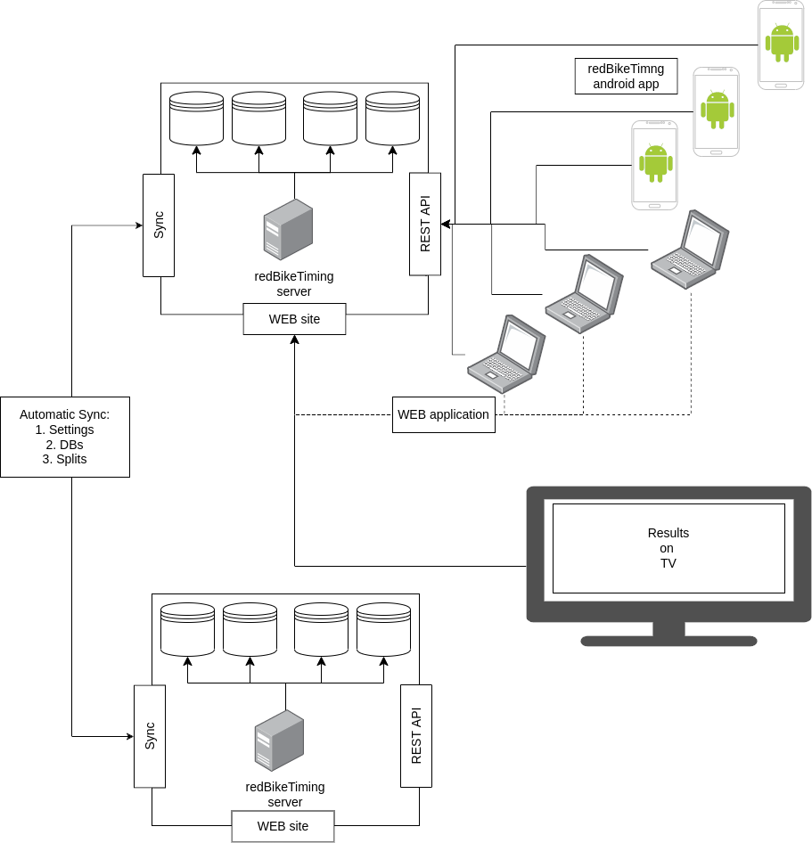

# redBikeTiming

https://rslt\.live/redbiketiming

# Operation scheme

# Схема работы

# Race select

# Выбор гонки

Races list

Список гонок

Create new race with empty cofiguration or copy them from another race\.

Создать гонку с пустой конфигурацией или скопировать из другой гонки\.

# Menu

# Меню

# Configuration

# Настройки

Upload start list as CSV

Загрузить стартовый список как CSV

Help for some elements

Помощь к некоторым элементам

Synchronization between multiple timing stations\.

Allowed to send or receive: 

	  Settings\, StartList\, Splits\.

Синхронизация между станциями тайминга\.

Можно отправлять или получать: 

	  Настройки\, Стартовый список или Отсечки\.

# Start list

# Стартовый список

Select \(click or arrows\) and type

Выберите \(щелчок или стрелки\) и вводите

# Laps

# Круги

Splits are grouped inside “split group timeout”

Отсечки групируются в пределах опции “Групировать отсечки по времени”

1     2      3       4      5      6       7       8

|  | Name | Название | Description | Описание |
| :-: | :-: | :-: | :-: | :-: |
| 1 | Ignore | Игнорировать | To ignore split | Игнорировать отсечку |
| 2 | Ignore Group | Игнорировать Группу | To ignore whole group | Игнорировать группу отсечек |
| 3 | New Lap | Новый круг | Group will be used as new lap | Группа будет использована как новый круг |
| 4 | Start Lap | Стартовая отсечка | Use as start split | Использовать как стартовая отсечка |
| 5 | Intermediate Lap | Промежуточная отсечка | Use as intermediate split (not a lap) | Использовать как промежуточную отсечку (не круг) |
| 6 | Finish Split | Финишная отсечка | Use as finish split | Использовать как финиш |
| 7 | Finished Before Split | Финишировал ранее | Use lap before that as finish | Круг перед этой отсечкой будет считаться финишем |
| 8 | Use Split Time | Использовать эту отсечку | Use split time as time for group | Использовать время этой отсечки как время группы |

# Splits

# Отсечки

Splits from databases\. Splits appear with white backgroud and goe red after “Dead timeout” option\.

Отсечки из базы данных\. Отсечки появляются с белым фоном\, который краснеет после истеения “Времени неактивности”\.

# Manual splits

# Ручные отсечки

Splits saved automatically or manually by the button in the bottom\. 

Отсечки сохраняются автоматически или по кнопке внизу экрана\.

Used for manual splits\. One of the following type could be used: 

Используетс для ручной отсечки\. Один из следующих типов может быть использован:

Keyboard shortcuts could be shown by button\.

Назначение клавищ показывается по нажатию на кнопку\.

# TV

# ТВ

Page with results to be shown on TV\. Scrolls and reloads automatically\.

Страница с результатами для отображения на телевизоре\. Прокрутка и перезагрузка происходит автоматически\.

# Мобильное приложение

# Mobile app

Link to download and install mobile application\. QR code to scan from application to load settings \.

Ссылка для загрузки и установки мобильного приложения\. QR код для сканирования из приложения для загрузки настроек\.

# https://rslt.live/redbiketiming

